# <a name="Home"></a> Concurrency basics

## Table of Content:
- [Introduction](#intro)
- [Java process](#process)
- [Thread сreation](#creation)
- [Yield and Sleep](#sleep)
- [InterruptedException](#interrupted)
- [Callable](#Callable)
- [Monitor](#monitor)
- [Synchronization](#sync)
- [Lifecycle](#lifecycle)
- [Memory consistency](#memory)
    - [Double chech locking](#doublecheck)
    - [Atomic (Compare-and-Swap)](#atomic)
    - [Concurrent Collections](#collections)
    - [ConcurrentModificationException](#ConcurrentException)
    - [BlockingQueue](#BlockingQueue)
- [LockSupport (parking)](#LockSupport)
- [Executors](#executors)
    - [ThreadPoolExecutor](#threadPoolExecutor)
- [Fork/Join Pool](#forkjoin)
    - [ForkJoinTask](#forkJoinTask)
    - [RecursiveAction](#recursiveAction)
- [CompletableFuture](#completableFuture)
- [Ссылки](#links)


## [↑](#Home) <a name="intro"></a> Introduction
Данный материал - это попытка упорядочить и обобщить основы основ многопоточности.
Для удобства для работы с кодом будет использоваться [Visual Studio Code](https://code.visualstudio.com/) с установленным пакетом поддержки Java: [Visual Studio Java Pack](https://code.visualstudio.com/docs/java/java-tutorial).


## [↑](#Home) <a name="process"></a> Java process
Любая программа - это прежде всего код. А Java код содержится в **.java** файлах.
Например, возьмём код из примера [Lesson: The "Hello World!" Application](https://docs.oracle.com/javase/tutorial/getStarted/cupojava/win32.html#win32-2a):
```java
class HelloWorldApp {
    public static void main(String[] args) {
        System.out.println("Hello World!");
    }
}
```
Сохраним код в файл **HelloWorldApp.java** (например, при помощи Visual Studio Code).

Код на языке Java выполняется виртуальной машиной Java. Но для этого код должен быть предварительно скомпилирован в байт-код при помощи Java Compiler (утилиты **javac**).
Для этого откроем командную строку. В Windows это Win+R и выполнение команды **cmd**.
В Visual Studio Code это можно сделать через контекстное меню открытого файла:

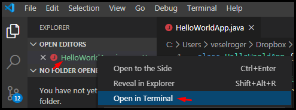

Для компиляции java кода в байт-код необходимо выполнить команду javac:
> javac HelloWorldApp.java

Когда байт-код готов необходимо запустить виртуальную машину Java (JVM).
Для этого выполняется команда java с указанием класса, содержащим точку входа (т.е. который содержит метод public static void main):
> java HelloWorldApp

Теперь изменим main метод следующим образом:
```java
public static void main(String[] args) {
	System.out.println(2 / 0);
}
```
После этого снова скомпилируем и запустим код.
**VS Code** позволяет это сделать через пункт "Run" в контекстном меню метода main в коде или прямо в коде можно выбрать **run**:

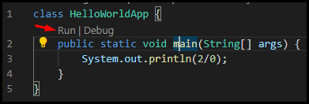

Выполнив код мы получим ошибку, в которой сказано, что в Java действует то же правило, что и в школе - делить на ноль нельзя (**ArithmeticException**).
Но интереснее сообщение о том, что ошибка произошла в **Thread "main"**:

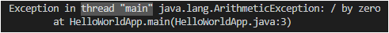

**Thread** - это поток выполнения программы. Когда мы выполняем команду **java**, то мы тем самым запускаем JVM. А JVM создаёт поток выполнения.
Java программа всегда имеет как минимум один поток, который называется **"main"**.

Чтобы рассмотреть java программу во время работы добавим в код бесконечный цикл:
```java
class HelloWorldApp {
    public static void main(String[] args) throws Exception {
        while(true) { }
    }
}
```
Выполним данное приложение. Оно ожидаемо уйдёт в бесконечный цикл.
Откроем для новой команды новую командную строку или новый терминал **VS Code**:

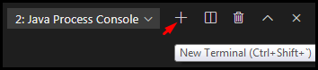

В наборе утилит JDK есть утилита "**[JPS](https://docs.oracle.com/javase/8/docs/technotes/tools/unix/jps.html)**" - **Java Process Status Tool**.
**Java Process Status Tool** позволяет узнать, какие сейчас запущены Java процессы. Для этого достаточно выполнить команду **jps**:

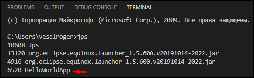

**Process (процесс)** - это выполнение инструкций компьютерной программы. Процессы изолированы друг от друга и являются некоторым набором выделенных ресурсов. За разграничение процессов отвечает операциионная система. Для этого операционная система обеспечивает каждый процесс отдельным **виртуальным адресным пространством**, так что ни один процесс не может получить прямого доступа к командам и данным другого процесса.

**Виртуальное адресное пространство процесса** – это совокупность адресов в памяти, которыми может манипулировать процесса.

У каждого процесса есть **Process ID** (**pid**). На скриншоте выше он равен 6520.
Каждый процесс является своего рода контейнером, в котором выполняются потоки (threads), относящиеся к этому процессу.

Чтобы посмотреть, из каких потоков состоит процесс можно открыть **java console**, выполнив команду **jconsole** и в качестве аргумента указать pid java процесса.
В JConsole мы можем увидеть все выполняемые потоки:


Мы так же можем получить состояние всех потоков на текущий момент времени в виде текста при помощи утилиты **[JSTACK](https://docs.oracle.com/javase/8/docs/technotes/tools/unix/jstack.html)**.
Выполним команду **jstack** с указанием в качестве параметра pid java процесса.
Например, ```jstack 6520``` покажет все потоки процесса 6520, в том числе **main**:

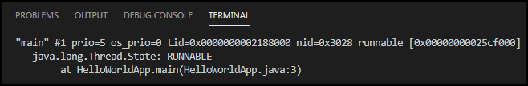

Таким образом, при запуске Java программы JVM создаёт главный поток, в котором начинается выполнение программы с точки входа в программу (main метода).
Помимо главного потока создаются ещё системные потоки для системных нужд JVM.

Чтобы поискать, что в Java есть по слову Thread, откроем Java Documentation.
В [Java doc](https://docs.oracle.com/javase/8/docs/api/) найдём документацию для [Thread](https://docs.oracle.com/javase/8/docs/api/java/lang/Thread.html#method.detail).

**java.lang.Thread** - это класс, который является интерфейсом взаимодействия с потоками, доступный Java разработчику.
Например, можно получить поток, в котором выполняется код (**[Thread.currentThread](https://docs.oracle.com/javase/8/docs/api/java/lang/Thread.html#currentThread--)**):
```java
class HelloWorldApp {
    public static void main(String[] args) {
        Thread currentThread = Thread.currentThread();
        ThreadGroup group = currentThread.getThreadGroup();
        System.out.println("Thread: " + currentThread.getName());
        System.out.println("Group: " + group.getName());
		System.out.println("Parent group: " + group.getParent().getName());
    }
}
```
Как видно, потоки организованы в структуру при помощи групп ([java.lang.ThreadGroup](https://docs.oracle.com/javase/8/docs/api/java/lang/ThreadGroup.html)).
Группы в свою очередь выстраиваются в виде дерева, в котором группа может иметь родителя. Например, главный поток **main** находится в группе **main**, которая в свою очередь является дочерней для системной группы **system**.
Группы позволяют удобно управлять потоками внутри этой группы: получать список, ограничивать приоритет, а так же обрабатывать неперехваченные исключения при помощи **UncaughtExceptionHandler**.

Каждый поток может иметь свой обработчик неперехваченных исключений. Если у потока нет такого хэндлера, то у группы вызывается метод [uncaughtException](https://docs.oracle.com/javase/8/docs/api/java/lang/Thread.UncaughtExceptionHandler.html#uncaughtException-java.lang.Thread-java.lang.Throwable-). По умолчанию, если группа имеет родителя - то метод вызывается у родителя. Если родителя нет, то вызывается или дефолтный UncaughtExceptionHandler(его можно указать через статический метод Thread) или просто печатается System.err.print и stacktrace из Exception.

Подробнее про процессы и потоки можно прочитать тут: "[Многопоточность в Java](https://habr.com/ru/post/164487/)".


## [↑](#Home) <a name="creation"></a> Java Thread сreation
Java позволяет создавать новые потоки выполнения из Java кода.
Цель потока - запустить на выполнение код, то есть сделать **Run**.
Поэтому есть специальный интерфейс **java.lang.Runnable**:
```java
Runnable task = new Runnable() {
	@Override
	public void run() {
		System.out.println("Thread: " + Thread.currentThread().getName());
	}
};
```

Начиная с версии Java 1.8 появилось понятие **"функциональный интерфейс"**. Функциональный интерфейс (**@FunctionalInterface**) означает, что если есть некоторый интерфейс, у которого есть лишь один нереализованный метод, то Java может догадаться, какой метод будет вызываться по короткой записи. Такая запись называется **лямбдой** и вызов с лямбдой будет выглядеть следующим образом:
```java
Runnable task = () -> System.out.println(Thread.currentThread().getName());
```
JVM понимает, что ``()`` означает отсутствие входных параметров (ведь метод ``run()`` без параметров), а так же у нас нет возвращаемого результата (т.к. метод void).

**Runnable** - это блок кода, который можно выполнить в отдельном потоке.
Чтобы его выполнить в отдельном потоке нужно создать экземпляр **Thread**:
```java
Runnable task = () -> System.out.println(Thread.currentThread().getName());
Thread newThread = new Thread(task);
newThread.start();
```
Стоит отметить, что **Thread** - это наследник **Runnable**, поэтому у него есть тоже метод **run**, который в свою очередь вызывает метод run у того runnable, который мы передали при конструировании Thread.

Вторым способом создания потока является создание наследника Thread, у которого будет переопределён метод run:
```java
Thread newThread = new Thread() {
	@Override
	public void run() {
		System.out.println("Thread: " + Thread.currentThread().getName());
	}
};
newThread.start();
```
Данный способ менее предпочтителен и используется очень редко, для добавления логики по обслуживанию самих потоков, а не логики выполнения.

**Thread** - это API или интерфейс для взаимодействия с многопоточной средой выполнения. Если посмотреть на метод **start**, которым мы запускаем поток, то он он вызывет другой метод start, который помечен как **native**. Это потому что работа с потоками реализована на стороне виртуальной машины Java (JVM) и операционной системы:

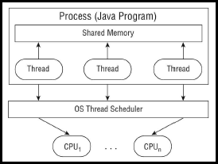

Потоки можно разделить на две категории: обычные и демон-потоки (Daemon thread).
Для демон потоков должен быть выставлен специальный флаг:
```java
Runnable task = () -> { while(true){} };
Thread newThread = new Thread(task);
newThread.setDaemon(true);
newThread.start();
```

**Daemon thread** - это служебный поток, выполняемый для фоновых операций.
Завершение демон потоков не обязательно для завершения выполнения программы.

Таким образом, Java процесс живёт до тех пор, пока жив хотя бы один **НЕ** демон поток. Например, как мы видели выше, Java Finalizer создаёт поток FinalizerThread, который при необходимости запускает метод **finalize()**. Данный поток служебный и его завершение не требуется для завершения программы, т.к. он имеет смысл только пока есть главные потоки, которые он обслуживает.
Термин "демон-поток" — это отсылка к "демону Максвелла", о чём подробнее можно прочитать в википедии в статье про "[демонов](https://ru.wikipedia.org/wiki/Демон_(программа)" =).

При создании нового потока значения группы и демон потока берутся из того потока, который запускает этот новый поток. Интересно, что группа тоже может быть демон-группой. Такая групп будет автоматически уничтожена, когда её последний поток остановлен или уничтожен.

У потока может быть так же указан приоритет, от 1 до 10. Или же могут быть использованы системные константы этих значений. Например:
```java
Runnable task = () -> System.out.println(Thread.currentThread().getName());
Thread newThread = new Thread(task);
newThread.setPriority(Thread.MAX_PRIORITY);
```
**Приоритет** - лишь подсказка планировщику потоков, реализованному на стороне операционной системы, какому потоку желательно отдавать приоритет при выполнении. Как в результате будут запускаться потоки - зависят от многих факторов (например, от ОС).

Для правильной организации выполнения потоков используются механизмы синхронизации.


## [↑](#Home) <a name="sleep"></a> Yield and Sleep
Прежде всего, нужно разобраться немного с терминами.
**Clock tick** - это своего рода принятая условная единицы осчёта, которая в разных операционных системах может отличаться.
Clock tick в Windows и Linux отличаются в продолжительности в мс (похоже на то, как один доллар и один евро содержат разное количество рублей).

**Timeslice** - это некоторое число clock tick, в течении которых потоку разрешается занимать процессор для выполнения своих действий.

В Java самым простым и самым редко используемым методом влияния на время выполнения является метод **Thread.yield**.
**Thread.yield** - метод сообщает планировщику потоков ОС, что поток, из которого вызван данный метод, готов уступить выполнение более приоритетным задачам.
Выполнение данного метода сильно зависит от реализации JVM и используемой операционной системы. Есть вероятность того, что поток, в котором выполнен данный метод, отдаст свой timeslice и будет ожидать получение нового timeslice в соответствии с релизацией JVM и используемой ОС.
Подробнее можно прочитать в статье на Javamex: "[Thread.yield](https://www.javamex.com/tutorials/threads/yield.shtml)".

Другой способ приостановить поток - статический метод **Thread.sleep**.
**Thread.sleep** - метод перевода потока из состояния **[RUNNABLE](https://docs.oracle.com/javase/8/docs/api/java/lang/Thread.State.html#RUNNABLE)** (т.е. запущен) в состояние **[TIMED_WAITING](https://docs.oracle.com/javase/8/docs/api/java/lang/Thread.State.html#TIMED_WAITING)** (т.е. ожидает).
Таким образом процесс отдаст своё процессорное время (timeslice) на время сна:
```java
public static void main(String[] args) {
	Runnable task = () -> {
		try {
			Thread.sleep(1000 * 60 * 2);
		} catch (InterruptedException e) {
			e.printStackTrace();
		}
		System.out.println("Hello, World!");
	};
	Thread newThread = new Thread(task);
	newThread.start();
}
```
Запустим данный код. Аналогично тому, как мы делали ранее, запустим новый терминал и в нём при помощи jps и jstack получим статус потоков.
Мы увидим наш поток в состоянии **TIMED_WAITING**, то есть временное ожидание:

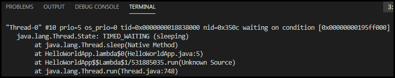

Кроме того, при Sleep поток значится как **waiting on condition** - то есть ожидает некоторого условия, по которому его разбудит планировщик потоков операционной системы.

Thread.sleep можно выполнить красивее при помощи **java.util.concurrent.TimeUnit**:
```java
TimeUnit.MINUTES.sleep(2);
```

[!] Важно помнить замечание из JLS, а именно из раздела [17.3. Sleep and Yield](https://docs.oracle.com/javase/specs/jls/se8/html/jls-17.html#jls-17.3):
> It is important to note that neither Thread.sleep nor Thread.yield have any synchronization semantics.

Далее мы ещё к этому вернёмся, а пока важно это просто запомнить "как есть".
Кроме того, засыпание потока, как и любое ожидание потоком, требует обработки **InterruptedException**, т.к. во время ожидания со стороны поток может быть кем-то прерван вызовом метода **interrupt**.


## [↑](#Home) <a name="interrupted"></a> InterruptedException
В Java c давних пор есть идея безопасносного прерывания потоков.
Чтобы прервать поток, кто-то должен выполнить на instance потока метод **[interrupt()](https://docs.oracle.com/javase/8/docs/api/java/lang/Thread.html#interrupt()**:
```java
public static void main(String[] args) {
	Thread th = new Thread(() -> {
		while(!Thread.currentThread().isInterrupted()) {
		};
		System.out.println("Interrupted");
	});
	th.start();
	th.interrupt();
}
```
Прерывание потока происходит путём сообщения потоку, что кто-то запросил его прерывание. Поток сам решает, как и когда он должен прерваться. То есть поток может и проигнорировать это сообщение и работать дальше, если так надо.
Такой подход, когда поток сам решает как он должен завершится, позволяет закрыть все необходимые рерсурсы корректным образом и не оставлять после себя неконсистентные данные.
На эту тему есть небольшой урок: "[Oracle Tutorial: Interrupts](https://docs.oracle.com/javase/tutorial/essential/concurrency/interrupt.html)".

Метод **interrupt** проставляет значение флага **isInterrupted** у прерываемого потока. Интересно, что этот флаг выставляется у потока при помощи native вызова.
Хотя это понятно, если подумать о том, что в этом случае планировщик потоков должен увидеть, что нужно снова запланировать в работу поток, который ранее ожидал.

Флаг **isInterrupted** ведёт себя по-разному:
- Если поток прерывается во время ожидания (когда Thread.State в значении WAITING или TIMED_WAITING, например во время во время **Thread.sleep**), то в потоке происходит исключение **InterruptedException**, которое сбрасывает флаг isInterrupted.
- Если поток прерывается в момент выполнения кода (например, во время выполнения цикла while), то флаг выставляется в значение true до тех пор, пока кто-то флаг не сбросит. В этом случае в потоке нужно вручную обработать состояние флага.
Для этого используется:
-- **Thread.currentThread().isInterrupted()** (в этом случае флаг проверяется, но не сбрасывается)
-- статический метод **Thread.interrupted()** (в этом случае флаг сбрасывается).

Подробнее можно прочитать здесь: "[Java Threads, Second Edition by Henry Wong, Scott Oaks](https://www.oreilly.com/library/view/java-threads-second/1565924185/ch04s05.html)".

Изначально Oracle заложил в Java возможность "убивать" потоки, но быстро выяснилось, что так делать неправильно. Сейчас это deprecated методы, о чём от Oracle есть статья-обхяснение: [Java Thread Primitive Deprecation](https://docs.oracle.com/javase/8/docs/technotes/guides/concurrency/threadPrimitiveDeprecation.html)


## [↑](#Home) <a name="Callable"></a> Callable
Ранее были рассмотрены потоки, которые не возвращали никакой результат, а просто должны были сделать что-то.
Для возвращения потоком результата в Java есть интерфейс **java.util.concurrent.Callable**.
Например, у нас может быть супер математически сложная задача:
```java
Callable task = new Callable() {
	@Override
	public Object call() throws Exception {
		return 2 + 2;
	}
};
```
Или, как мы ранее делали, можем написать её лямбдой:
```java
Callable task = () -> {
	Thread.currentThread().sleep(1000);
	return 2 + 2;
};
```
Стоит обратить внимание, что **Thread.sleep** нас не вынудил обрабатывать исключение. Всё потому, что метод ```call throws Exception```, а значит обработку исключений можно не писать в самой задаче Callable.

**FutureTask** - позволяет описать задачу (task), которая выполнится во **Future**.
Таким образом, код выполнения **Callable** будет выглядеть следующим образом:
```java
public static void main(String[] args) {
	Callable task = () -> {
		Thread.currentThread().sleep(1000);
		return 2 + 2;
	};
	FutureTask future = new FutureTask(task);
	new Thread(future).start();
    try {
    	System.out.println(future.get());
    } catch (InterruptedException | ExecutionException e) {
		e.printStackTrace();
	}
}
```
Если выполнение задачи является асинхронным, то метод get - синхронный. При этом мы можем получить Exception как из-за прерывания, так и из-за возникших Exception в выполняемой Callable.
Далее необходимо рассмотреть средства синхронизации потоков.


## [↑](#Home) <a name="monitor"></a> Monitor
В Java каждый объект имеет ассоциированный с ним монитор. Что это такое?
Тут добавляет некоторую трудность тот факт что монитор - это целый механизм синхронизации, который работает по разному в зависимости от того, какого вида конкурентная работа выполняется.

Для начала вспомним, что у каждого объекта в Java есть заголовок (**Object Header**). **Object Header** — своего рода внутренние метаданные, которые недоступны из java кода, но которые нужны виртуальной машине Java, чтобы работать с объектами правильно.
В состав заголовка объекта входит **Mark Word**, которое описывает состояие объекта.
Подробнее про Mark Word можно прочитать здесь:
- [IBM Developer: Anatomy of a Java object](https://www.ibm.com/developerworks/library/j-codetoheap/index.html).
- "[Заголовок Java объекта (16.04.2019)](https://habr.com/ru/post/447848/)"


Итак, нам нужен Java объект, чтобы получить ассоциированный с ним монитор:
```java
public static void main(String[] args) {
	Object monitor = new Object();
}
```
После этого потоку необходимо занять этот монитор. Для этого используется ключевое слово **synchronized**, а секцию с synchronized называют критической.
Использование критической секции гарантирует, что код в этой критической секции одновременно может быть выполнен только одним потоком.
Например:
```java
public static void main(String[] args) {
	Object monitor = new Object();
	Runnable task = () -> {
		synchronized(monitor) {
			System.out.println("Thread: " + Thread.currentThread().getName());
		}
	};
	task.run();
}
```
В данном случае выполняется метод run напрямую у Runnable, т.е. просто в том же потоке, который выполняет данный код, т.е. в потоке **main**.
JVM видит, что синхронизация по monitor выполняется только одним потоком. В таком случае будет использован простейший монитор - **biased monitor**.
**Biased monitor** - это монитор, который являются просто записью в header объекта, содержащей ID потока, который владеет монитором. Это нужно для того, чтобы при любой новой блокеровке понимать, монитор пытается захватить тот же поток, что и раньше, или нет. Это является своего рода оптимизацией и позволяет сократить накладные расходы на синхронизацию.

После того, как будет выполнен выход из synchronized секции, данные о прошлом владельце монитора остаются в заголовке объекта. Поэтому, если монитор займут из другого потока, то разницу в ID потоков увидит JVM.
Например, добавим в метод main в самый конец создание нового потока:
```java
Thread newThread = new Thread(task);
newThread.start();
```
JVM обнаруживает, что за один и тот же монитор могут соперничать несколько разных потоков и выполняет **revoke bias**. Теперь будет использован **thin monitor**.

**Thin monitor** - это легковесный монитор. Легковесность заключается в том, что в стэк захватившего монитор потока сохранятся ссылка на markword объекта, с которым ассоциирован монитор. Например, новый Thread-0 занимает монитор, ассоциированный с monitor. JVM при этом видит, что раньше монитор был занят main потоком. Т.к. потоки разные, то выполнит переход на легковесный монитор. В стэк потока Thread-0 сохранится ссылка на markword объекта monitor.

[!] Интересно, что в заголовке объекта в одном и том же месте может одновременно храниться или hashcode объекта или информация о biased lock. Таким образом, любой запрос System.identityHashCode сохранит в заголовок объект хэш код, вытеснив от туда данные biased lock'а.
Подробнее см. "[Как работает hashCode() по умолчанию?](https://habr.com/ru/company/mailru/blog/321306/)".

Каждый раз, когда какой либо поток пытается использовать thin monitor, JVM будет пытаться выполнить CAS (Compare-and-swap) операцию. То есть JVM возьмёт из монитора ссылку и проверит, есть ли она в стэке текущего потока. Если нет - JVM попробует переключить монитор на новый поток. В случае, если CAS не сможет переключить монитор (т.к. два потока одновременно пытаются захватить монитор), то легковесный монитор будет переключен на **inflated monitor**.

**Inflated monitor** - так называемый "раздутый" монитор. Его обслуживание требует больше ресурсов. Кроме того, раздутый монитор имеет **Waitset** (потоки ожидающие сообщение чтобы попробовать занять монитор) и очередь **Entry List**, в которой потоки ожидают до тех пор, пока монитор не освободится и они смогут этот монитор занять.

Данный переход монитора из одного состояния в другое можно описать следующим образом:

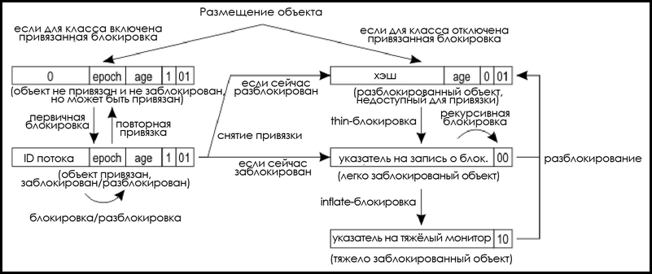

Стоит помнить, что ключевое слово **synchronized** может применяться так же для методов. В таком случае если метод относится к instance (то есть метод не статический), то монитор будет браться у instance. А если метод относится к классу (т.е. метод статический), то монитор будет браться у .class.

Про различные состояния монитора можно прочитать следующий материал:
- [Biased Locking in HotSpot](https://blogs.oracle.com/dave/biased-locking-in-hotspot)
- [А как же всё-таки работает многопоточность? Часть I: синхронизация](https://habr.com/ru/post/143237/)
- [Synchronization and Object Locking](https://wiki.openjdk.java.net/display/HotSpot/Synchronization)
- [Chapter 20: Thread Synchronization](https://www.artima.com/insidejvm/ed2/threadsynchP.html)


## [↑](#Home) <a name="sync"></a> Synchronization
Monitor - это центральная концепция синхронизации в Java.
Т.к. монитор ассоциирован с объектом, то синхронизация через монитор выполняется через методы Object.
У класса Object есть метод [wait](https://docs.oracle.com/javase/8/docs/api/java/lang/Object.html#wait--). Данный метод обращается к монитору и ставит обращающийся поток в очередь ожидания (wait set) на данном мониторе:
```java
public static void main(String[] args) {
	Object monitor = new Object();
	Runnable task = () -> {
		synchronized(monitor) {
			// monitor.notify();
		}
	};
	synchronized(monitor) {
		Thread newThread = new Thread(task);
		newThread.start();
		try {
			monitor.wait();
		} catch(InterruptedException e) {
			System.out.println("interrupted!");
		}
	}
}
```
Если выполнить данный код, то программа никогда не завершится, т.к. main поток захватил монитор, запустил новый поток, потом перешёл в wait set монитор и отпустил монитор. Новый поток после этого успешно вошёл в synchronized блок, в котором есть только закомментированный код, и завершил свою работу. Таким образом у нас есть main поток в состоянии "[WAITING](https://docs.oracle.com/javase/8/docs/api/java/lang/Thread.State.html#WAITING)".

[!] Важно понимать, что метод wait приводит к тому, что монитор приходится переводит в режим **inflated**, т.к. только в этом случае есть где хранить wait set монитора.

Если выполнить jps и jstack, то мы увидим статус потока следующим образом:

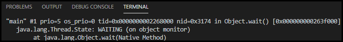

Чтобы поток вернулся к работе необходимо вызвать метод **notify** на мониторе.
Расскомментируем строку ```//monitor.notify();```, а так же добавим бесконечный цикл после:
```java
Runnable task = () -> {
	synchronized(monitor) {
		monitor.notify();
		while(true) {}
	}
};
```
Выполним код и мы снова застрянем на выполнении. Дело в том, что task уведомляет поток, ожидающий на мониторе, что он может продолжить работу. Однако, из-за бесконечного цикла поток с task не завершается и монитор не освобождается. А поток main из wait set переходит в Entry list и ожидает, когда монитор разблокируется. Таким образом его статус изменится на **[BLOCKED](https://docs.oracle.com/javase/8/docs/api/java/lang/Thread.State.html#BLOCKED)**.
Увидеть это можно в jstack следующим образом:

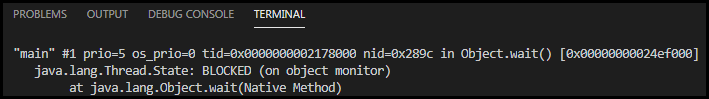

Уведомлять можно не только методом **notify** (уведомить один поток из всех потоков, ожидающих в wait set), но и методом **notifyAll** (уведомить всех ожидающих). Если уведомить всех, то в лучшем случае один поток сможет захватить монитор, а все остальные перейдут в список ожидающих монитор (в Entry list).

Метод wait вызывается неявным образом, если мы волним метод **Thread.join**.
**Thread.join** - это метод присоединения потока, в котором выполняется данный метод к другому потоку. Присоединение будет означать, что поток продолжит своё выполнение только тогда, когда поток, к которому он присоединён, завершится. Например:
```java
public static void main(String[] args) {
	Runnable task = () -> {
		try {
			TimeUnit.MINUTES.sleep(2);
		} catch (InterruptedException e) {
			e.printStackTrace();
		}
	};
	Thread newThread = new Thread(task);
	newThread.start();
	try {
		newThread.join();
	} catch (InterruptedException e) {
		e.printStackTrace();
	}
    System.out.println("Hello, World!");
}
```
В данном случае статус main потока станет "[WAITING](https://docs.oracle.com/javase/8/docs/api/java/lang/Thread.State.html#WAITING)". На самом деле, метод **join** внутри скрывает вызов метода **wait**.
В jstack мы это увидим:

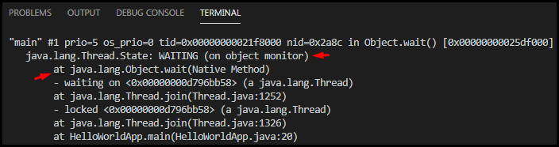


## [↑](#Home) <a name="lifecycle"></a> Lifecycle
Ранее были рассмотрены различные переходы потока из одного статус в другой. Такие перехода и составляют жизненный цикл потока.
Жизненный цикл потока описан константами в "[Enum Thread.State](https://docs.oracle.com/javase/8/docs/api/java/lang/Thread.State.html)".
Изобразить это можно так:

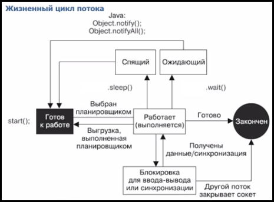


## [↑](#Home) <a name="memory"></a> Memory consistency
Итак, у нас есть несколько одновременно выполняющихся потоков.
И тут возникает вопрос: как потоки должны видеть данные из других потоков?
Эта проблема называется "**[Memory consistency](https://docs.oracle.com/javase/tutorial/essential/concurrency/memconsist.html)**".

Разработчики Java разработали такое понятие как Java Memory Model - модель памяти.
Модель памяти Java или Java Memory Model (JMM) объясняет возможное поведение потоков (какие данные и когда они видят) и то, на что должен опираться программист, разрабатывающий приложение (то есть каким правилам следовать).

Проблема memory consistency решается правилами, называемыми **Happens before**.
Данные правила можно изобразить следующим образом:

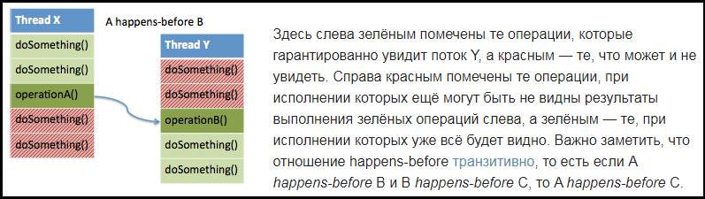

Данная картинка взята из статьи: [Модель памяти в примерах и не только](https://habr.com/ru/post/133981/).

Правила Happens Before описаны как в Java Language Specification ([17.4.5. Happens-before Order](https://docs.oracle.com/javase/specs/jls/se8/html/jls-17.html#jls-17.4.5)), так и в javadoc пакета [java.util.concurrent](https://docs.oracle.com/javase/8/docs/api/java/util/concurrent/package-summary.html#MemoryVisibility).

Отношением **Happens-before** связаны следующие события:
- В одном потоке любая операция happens-before следующей за ней в коде
- Запись **volatile** поля happens-before чтение того же самого volatile поля
- Выход из synhronized блока/метода happens-before вход в synhronized блок/метод на том же мониторе
- Вызов метода interrupt() на потоке happens-before когда поток обнаружил, что данный метод был вызван либо путем выбрасывания исключения InterruptedException, либо с помощью методов isInterrupted() или interrupted()
- Завершение метода run экземпляра класса Thread happens-before выход из метода join() или возвращение false методом isAlive() экземпляром того же треда
- Освобождение лока (unlock) happens-before захват того же лока (lock)
- Вызов метода start() экземпляра класса Thread happens-before начало метода run() экземпляра того же треда
- Завершение конструктора happens-before начало метода finalize() этого класса

Согласно JLS (см "[8.3.1.4. volatile Fields](https://docs.oracle.com/javase/specs/jls/se8/html/jls-8.html#jls-8.3.1.4)"), одним из способов убедиться в корректности видимости изменений является ключевое слово **volatile**. Ключевое слово **volatile** кроме прочего обеспечивает атомарность изменений (чтения и записи) типов double and long, о чём сказано в JLS (см. [17.7. Non-Atomic Treatment of double and long](https://docs.oracle.com/javase/specs/jls/se8/html/jls-17.html#jls-17.7)).

Для погружения в тему Happens-before есть следующие материалы:
- [JSR 133 (Java Memory Model) FAQ (перевод)](https://habr.com/ru/company/golovachcourses/blog/221133/)
- [Java - Understanding Happens-before relationship](https://www.logicbig.com/tutorials/core-java-tutorial/java-multi-threading/happens-before.html)
- [Алексей Шипилёв — Близкие Контакты JMM-степени (2016)](https://www.youtube.com/watch?v=C6b_dFtujKo).
- [Concurrency Concepts in Java by Douglas Hawkins](https://www.youtube.com/watch?v=ADxUsCkWdbE)
- [А как же всё-таки работает многопоточность? Часть II: memory ordering](https://habr.com/ru/post/209128/)
- [Тред Ариадны: как полюбить JSR-133. Доклад Яндекса](https://habr.com/ru/company/yandex/blog/477074/)


### [--](#Home) <a name="doublecheck"></a> Double chech locking
Одним из проблем, связанных с Happens-before, является **double check locking**.
На эту тему есть отличная статья на английском от Шипелёва: "[Safe Publication and Safe Initialization in Java](https://shipilev.net/blog/2014/safe-public-construction/)". А так же "[Правильный Singleton в Java](https://habr.com/ru/post/129494/)".

Таким образом, **Double Check Locking** может выглядеть следующим образом:
```java
public class Singleton {
	private static volatile Singleton instance;

    public static Singleton getInstance() {
		Singleton localInstance = instance;
		if (localInstance == null) {
			synchronized (Singleton.class) {
				localInstance = instance;
				if (localInstance == null) {
					instance = localInstance = new Singleton();
				}
			}
		}
		return localInstance;
	}
}
```


### [--](#Home) <a name="atomic"></a> Atomic (Compare-and-Swap)
В многопоточной среде операции изменения значений (например, инкрементация переменной)  являются не безопасными, т.к. происходит чтение, изменение значения и запись его обратно в переменную. Так как данное действие выполняется не за одну операцию (т.е. не атомарно), то один поток может нарушить корректность вычислений другого.

Для решения данной проблемы в Java есть пакет **java.concurrent.atomic**.
В нём хранятся так называемые **"Атомики"**, которые благодаря алгоритмым CAS, реализованных на уровне процессоров и вызываемых через **native вызовы**, работают быстро и обеспечивают атомарность операций. Кроме всего, обеспечивается отношение happens-before.

Пример с **AtomicInteger** приведён в официальном tutorial от Oracle: [Atomic Variables](https://docs.oracle.com/javase/tutorial/essential/concurrency/atomicvars.html).


### [--](#Home) <a name="collections"></a> Concurrent Collections
Коллекции в Java - одно из самых часто используемых средств языка. Не удивительно, что  многопоточное использование коллекций добавляет проблем.

В давние давние времена для этих целей появились различные [врапперы/обёртки (паттерн декоратор)](https://refactoring.guru/ru/design-patterns/decorator/java/example) из пакета **java.util.Collections**::
```java
public static void main(String[] args) {
	List<String> list = new ArrayList<String>();
	// create a synchronized list
	List<String> synlist = Collections.synchronizedList(list);
}
```
Внутри такой обёртки есть объект, по монитору которого синхронизируются при помощи synchronize все действия, получающие доступ к содержимому коллекций.

Это не самый эффективный способ, поэтому разработчики Java предоставили набор **Concurrent Collections**, то есть набор коллекций, работающих в многопоточности.
На эту тему есть отличный обзор: [Обзор java.util.concurrent.*](https://habr.com/ru/company/luxoft/blog/157273/).

Например, если если синхронизировать HashMap через Collection, то мы будем блокировать всю Map, что не очень хорошо. Альтернатива - **ConcurrentHashMap**.
**ConcurrentHashMap** разделяет своё содержимое на сегменты и блокирует именно нужный сегмент, а не всю себя.
Количество сегментов по умолчанию равно 16 (параметр **concurrency-level**).
Если пара key-value хранится в 10-ом сегменте, то ConcurrentHashMap заблокирует, при необходимости, только 10-тый сегмент, и не будет блокировать остальные 15.
Подробнее можно прочитать здесь:
- [Как работает ConcurrentHashMap](https://habr.com/ru/post/132884/).
- [ConcurrentHashMap Internal Working in Java](https://medium.com/@mr.anmolsehgal/concurrenthashmap-internal-working-in-java-b2a1a48c7289)
- [Top 10 ConcurrentHashMap Questions from Java Interviews](https://javarevisited.blogspot.com/2017/08/top-10-java-concurrenthashmap-interview.html).

Есть потокобезопасные реализации ArrayList: **CopyOnWriteArrayList** и **CopyOnWriteArraySet**. Их изменение приводит к созданию полной копии содержимого, на время которого другие потоки, выполняющие изменение, будут заблокированы. Как сказано в JavaDoc это будет стоить производильности, но может оказаться полезно, когда одновременно происходит изменение коллекции в одном потоке и итерирование по данной коллекции в другом потоке. В данном случае при итерировании будет выполняться по состоянию коллекции ДО изменения.


### [--](#Home) <a name="ConcurrentException"></a> ConcurrentModificationException
Коллекции изначально не рассчитаны на модификацию их из разных потоков. Более того, от этого была специально сделана защита - ``protected transient int modCount``.
Данное поле помогает выявить одновременную работу с коллекцией из разных мест.
Такое поведение называется **Fail-Fast**, т.е. выявить ошибку как можно быстрее.
Это даже может быть не разные потоки. Например:
```java
List< String> list = new ArrayList(Arrays.asList("1","2","3"));
for (String string : list) {
	if (string.equals("1")) {
		System.out.println(string);
        list.remove(string);
	}
}
```
Как известно, for-each цикл является лишь синтаксическим сахаром, под которым скрывается вызов итератора. Итератор запоминает modcount, при котором он был создан.
Таким образом, каждый вызов next будет проверка, не изменился ли modcount.
Чтобы удалить элемент при проходе это нужно делать непосредственно через итератор, т.к. только тогда итератор обновит известное ему modCount.
А так же припомощи конструкции removeIf:
```java
List< String> list = new ArrayList(Arrays.asList("1","2","3"));
list.removeIf(element -> element.equals("2"));
```
Кроме того, есть так называемые **Weekly consistent** итераторы. Это итераторы, которые не падают с ошибкой конкурентного доступа. Например EnumSet или выше рассмотренные коллекции, где итератор видит состояние на момент его состояния и не видит изменения после.
**Дополнительно:** Итератор у листов кроме прочего имеет интересную реализацию проверки, есть ли дальше элемент: ``cursor != size;``. Это приводит к тому, что код выше отработает без ошибки в случае элемента 2 (т.к. размер коллекции после удаления будет равен позиции курсора и до элемента 3 мы не дойдём). А в случае 3 мы всё равно упадём с ошибкой, т.к. курсор 3 не равен размеру 2 и мы попробуем выполнить next.
Об этом можно увидеть в пазлерах: [#ITsubbotnik: Java пазлеры](https://youtu.be/V1CsqFYagEY?t=350).


### [--](#Home) <a name="BlockingQueue"></a> BlockingQueue
В рамках **Concurrent Collections** хочется выделить блокирующие очереди.
[**BlockingQueue**](https://docs.oracle.com/javase/8/docs/api/java/util/concurrent/BlockingQueue.html) - это очереди, получиение и добавление элемента в которые могут блокировать поток. Это происходит в двух случаях:
- Очень пуста и поток не может забрать из очереди элемент (т.к. его нет)
- Очень заполнена и поток не может положить элемент (т.к. нет места для него)

API данной коллекции представлено ниже:

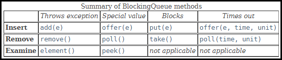

Очередь может быть ограничена по своему размеру (**bounded queue**) или не ограничена (**unbounded queue**, т.е. содержит Integer.MAX элементов). Если очередь ограничена, а в неё пытаются добавить ещё элемент, то произойдёт ошибка: **RejectedExecutionException**.

Пример блокирующей очереди:
```java
public static void main(String[] args) throws InterruptedException {
	BlockingQueue<String> queue = new SynchronousQueue<>();
	Thread th1 = new Thread(() -> {
		try {
			queue.poll(1, TimeUnit.MINUTES);
		} catch (InterruptedException e) {
			System.out.println("oops");
		}
	});
	th1.start();
	queue.offer("test", 1, TimeUnit.MINUTES);
}
```
В данном случае один поток ожидает в течении одной минуты, когда в очередь кто-нибудь положит элемент. Поток main в этом случае в очередь добавляет элемент, а если не сможет - ожидает минуту момент, когда всё таки сможет положить туда элемент. При этом благодаря использованию SynchronousQueue размер очереди всегда равен 1.
Если закомментировать queue.offer, то программа повиснет на 1 минуту, т.к. некому положить в очередь элемент. Выполнив jstack по pid мы увидим:

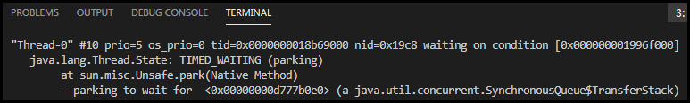

Таким образом, мы видим, что существует не только ожидание на мониторе, но и ещё один способ приостановить выполнение потока - парковка.


## [↑](#Home) <a name="LockSupport"></a> LockSupport (parking)
Для синхронизации потоков может быть использовано не только слово **synchronized**.
Начиная с Java 1.5 появился механизм **LockSupport**, который позволяет "парковать" потоки. Данный механизм находится в пакете **java.util.concurrent.locks**.

LockSupport позволяет поток запарковать (чем-то похоже на wait по смыслу) и распарковать (чем-то похоже на notify). В отличии от методов wait и notify при использовании LockSupport мы обращаемся к потокам не через монитор, а через сам поток.
Мы так же можем использовать Java объект как вспомогательная информация о блокировке.

Пример работы с LockSupport:
```java
public static void main(String[] args) throws InterruptedException {
	Object blocker = new Object();
	Runnable task = () -> {
		LockSupport.park(blocker);
		System.out.println("Unparked");
	};
	Thread th = new Thread(task);
	th.start();
	Thread.currentThread().sleep(1000);
	System.out.println("Thread state: " + th.getState());

    // Unpark
	if (LockSupport.getBlocker(th) != null) {
		System.out.println("Parked with blocker: " + LockSupport.getBlocker(th));
		LockSupport.unpark(th);
	}
}
```

**LockSupport** довольно низкоуровневый механизм и напрямую его обычно не используют.
На его основе реализованы "локи" **[java.util.concurrent.locks.Lock](https://docs.oracle.com/javase/8/docs/api/java/util/concurrent/locks/Lock.html)**.
Там можно найти одно важное замечание:
> Acquiring the monitor lock of a Lock instance has no specified relationship with invoking any of the lock() methods of that instance.

Например: **java.util.concurrent.locks.ReentrantLock**.
Вот наглядный пример:
```java
public static void main(String []args) {
	Lock lock = new ReentrantLock();

	Runnable task = () -> {
		lock.lock();
		System.out.println("2. thread");
		lock.unlock();
	};

	lock.lock();
	Thread th = new Thread(task);
	th.start();
	System.out.println("1. main");
	lock.unlock();
}
```
ReentrantLock похож по действию на synchronized, но реализован при помощи LockSupport и методов park / unpark. А так же он добавляет такие полезные методы, как проверка на лок (isLocked), попытку лока (tryLock), а так же позволяет указывать политику "честности" (fair). Про честность есть интересная статья: [Fair lock](http://bazhenov.me/blog/2011/04/17/fair-lock.html).
Кроме того, рекомендуется к прочтению: [Java Concurrency - ReentrantLock](https://bowenli86.github.io/2016/04/20/java/concurrency/Java-Concurrency-ReentrantLock/).
Кроме того, локи предоставляют возможность иметь один лок, но иметь от него разные условия, по которым будут "пробуждаться" разные потоки.
Пример можно увидеть в официальной документации: [java.util.concurrent.locks.Condition](https://docs.oracle.com/en/java/javase/11/docs/api/java.base/java/util/concurrent/locks/Condition.html).

На основе локов работают и так называемые "синхронизаторы".
Про них здесь: "[Справочник по синхронизаторам java.util.concurrent.*](https://habr.com/ru/post/277669/)".

Кроме того, есть интересный "феномен", который называется [spurious-wakeups](http://opensourceforgeeks.blogspot.com/2014/08/spurious-wakeups-in-java-and-how-to.html).


## [↑](#Home) <a name="executors"></a> Executors
Ранее мы каждый раз сами управляли потоками, их созданием и запуском. Хотя если подумать, то мы просто хотели выполнить (execute) наши runnable.
Разработчики Java подумали над этим и описали интерфейс **java.util.concurrent.Executor** для тех, кто будет заниматься управлением потоками. Пользователь же только будет напралять Executor'ам свои задачи на выполнение.

Существуют различные Executor'ы, поэтому есть специальный класс **Executors**.
**Executors** - утильный класс, который через статические методы позволяет создавать Executor'ы.
**ExecutorService** - это наследник **Executor**. Можно сказать, что ExecutorService - это Executor, который умеет обслуживать (service) выполняемые задачи: отслеживать прогресс, останавливать их и т.д.

Например:
```java
public static void main(String[] args) {
	Callable< String> task = () -> Thread.currentThread().getName();
	ExecutorService service = Executors.newFixedThreadPool(2);
	for (int i = 0; i < 5; i++) {
    	Future result = service.submit(task);
		try {
			System.out.println(result.get());
		} catch (InterruptedException | ExecutionException e) {
			e.printStackTrace();
		}
	}
	service.shutdown();
}
```
Данный код создаёт фиксированный пул потоков (Fixed Thread Pool) размером 2.
После чего поочередно отправляются в пул задачи. Каждая задача возвращает строку, содержащую имя потока.
(!) Важно в самом конце выполнить shutdown для ExecutorService, потому что в противном случае наша программа не завершится, т.к. ExecutorService по прежнему будет ожидать новые задачи. Веки вечные.

Важно понимать, что есть два варианта завершения ExecutorService - **shutdown** и **shutdownNow**. Разница в том, что первый просто не даёт больше принимать задачи. А второй в добавок к этому пытается вызвать **interrupt** уже выполняющимся потокам.
Кроме того, ExecutorService может быть isTerminated тогда, когда все потоки завершены, а ExecutorService больше не может принимать задачи (т.е. выполнен или shutdown или shutdownNow).

Если ExecutorService не может больше принимать задачи, а ему дать новую - это приведёт к исключению: **java.util.concurrent.RejectedExecutionException**.
Кроме того можно ограничить и выполнение потоков. Например:
```java
Future< String> future = executor.submit(task);
try {
	future.get(5, TimeUnit.SECONDS);
} catch(TimeoutException ex) {
	future.cancel(true); // cancel and send a thread interrupt
	log.error("Error parsing HTML. Timed out");
} finally {
	executor.shutdownNow();
}
```

Есть различные Executor'ы. Всё их различие в том, что они возвращают:

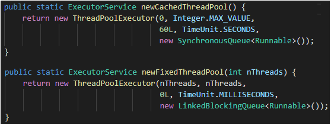


### [--](#Home) <a name="threadPoolExecutor"></a> ThreadPoolExecutor
Итак, **ThreadPoolExecutor** является основой, на которой строятся различные **ExecutorService**, возвращаемые фабрикой **Executors**.

**ThreadPoolExecutor** может быть создан с различными параметрами:

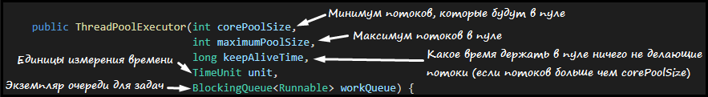

Стоит рассмотреть на конкретных примерах, как эти параметры влияют на работу.

**Single Thread** - одиночный поток - самый простой ExecutorService.
Достигнуть это можно двумя способами:
```java
ExecutorService service = Executors.newSingleThreadExecutor();
ExecutorService fixedThread = Executors.newFixedThreadPool(1);
```
Может даже показаться, что они одинаковы.
Оба эти **ExecutorService** используют **LinkedBlockingQueue**, оба будут не меньше и не больше 1 потока.
Но **SingleThreadExecutor** имеет особенность:
> the returned executor is guaranteed not to be reconfigurable

Это достигается при помощи того, что в качестве **ExecutorService** метод **newSingleThreadExecutor** возвращает не **ThreadPoolExecutor**, а обёртку над ним.
Таким образом не выполнить каст к **ThreadPoolExecutor** и не поменять размер пула.

**Cached Thread Pool** - кэшированный пул потоков.
Внутри он устроен следующим образом:
```java
public static ExecutorService newCachedThreadPool() {
        return new ThreadPoolExecutor(0, Integer.MAX_VALUE,
                                      60L, TimeUnit.SECONDS,
                                      new SynchronousQueue<Runnable>());
}
```
Тут интересно, что используется SynchronousQueue, которая блокирует поток, который кладёт значение до того момента, пока другой поток не возьмёт его.

**Sheduled Thread Pool** - это ещё один интересный пул. Как видно из названия, данный пул позволяет планировать время запуска новых задач.
Это реализовано засчёт использования ThreadPoolExecutor'ом особой очереди, похожей в чём-то на DelayQueue.
Пример использования:
```java
public static void main(String[] args) throws Exception {
	ScheduledExecutorService service = Executors.newSingleThreadScheduledExecutor();
	service.schedule(() -> {
		System.out.println("Test");
		service.shutdown();
	}, 2, TimeUnit.SECONDS);
}
```
Существует несколько возможностей задать расписание:

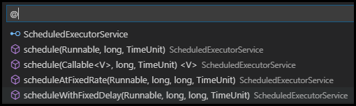

Напоследок остаётся сказать пару слов про **Work Stealing Pool**.
**WorkStealingPool** - это пул, в котором потоки, если они освободились от работы, не простаивают, а забирают задачи других потоков.

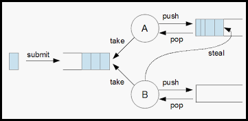

Описание данной модели можно найти в "[Анатомия модели fork-join: Захват работы](https://www.ibm.com/developerworks/ru/lib"rary/j-jtp11137/index.html)":
Каждый поток имеет собственную двустороннюю очередь. Задача, поступающая в поток, помещается в начало очереди потока. Если поток завершает выполнение задачи, то он берёт из начала очереди. Если очередь пуста - поток пытается "steal" ("украсть") задачи из других потоков, из конца (хвоста) очереди.
Важно знать, что доступ к началу очереди есть только у самого потока, что обеспечивает отсутствие конкурекнции за начало очереди. А т.к. доступ к хвосту очереди будет осуществлён только при завершении работы потока, то такие случае не так часты. Это позволяет снизить стоимость синхронизации по сравнению с традиционным подходом на основе пула потоков.

Создание Work stealing pool похоже на все остальные:
```java
ExecutorService service = Executors.newWorkStealingPool();
```

Всё отличие прячется в реализации данного метода. Если мы посмотрим в него, то увидим, что в нём "спрятано" создание **ForkJoinPool**:
```java
public static ExecutorService newWorkStealingPool() {
        return new ForkJoinPool
            (Runtime.getRuntime().availableProcessors(),
             ForkJoinPool.defaultForkJoinWorkerThreadFactory,
             null, true);
}
```
Дальнейший путь ведёт к рассмотрению механизма **Fork/Join Pool**.


## [↑](#Home) <a name="forkjoin"></a> Fork/Join Pool
Как мы ранее увидели, в качестве ExecutorService может быть использован Fork/Join Pool. Данный механизм появился ещё в Java 1.7.
Основная идея как раз выражена в идее Work Stealing pool.
Простаивающие потоки - это плохо и FJP - это решение этой проблемы.

Каждый поток имеет очереди своих задач. Как мы видели, FJP может принимать внешние Callable и Runnable. Это всё благодаря тому, что у потоков есть очередь для внутренних задач и очередь для внешних задач (т.е. задач через submit).

По теме Fork Join Pool обязателен к просмотру доклад:
[Алексей Шипелёв: High Performance Fork/Join in Java(2015)](https://www.youtube.com/watch?v=yWPLeu0kvBo)

### [--](#Home) <a name="forkJoinTask"></a> ForkJoinTask
Кроме внешних задач FJP умеет работать с внутренними задачами - **ForkJoinTask**.
[ForkJoinTask](https://docs.oracle.com/javase/8/docs/api/java/util/concurrent/ForkJoinTask.html) - это задача из мира Fork Join Pool. Её отличие от задач внешних в том, что она позволяет выполнять более гибкое управление задачами. Например, при помощи метода **fork** можно задачу разбить на подзадачи, а при помощи метода **join** ожидать завершения задачи.

Есть два основных наследника ForkJoinTask: **RecursiveAction** и **RecursiveTask**.
На самом деле, это довольно интересная идея. Для начала, нам нужно описать задачу.
Например, классика рекурсивной задачи - числа Фибоначчи. На них даже официальная документация [RecursiveTask](https://docs.oracle.com/javase/8/docs/api/java/util/concurrent/RecursiveTask.html) приводит пример. И вот почему:

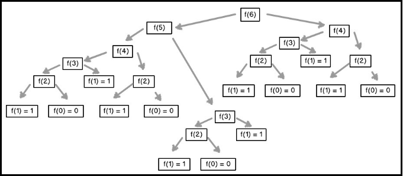

Для начала, создадим новый класс:
```java
public static class FibonacciTask {
	private final int number;

	FibonacciTask(int number) {
		this.number = number;
	}
}
```
Теперь опишем метод "вычислить" (compute):
```java
public Integer compute() {
	if (number < 2) return number;
	FibonacciTask f1 = new FibonacciTask(number - 1);
	FibonacciTask f2 = new FibonacciTask(number - 2);
	return f2.compute() + f1.compute();
}
```

А теперь самое время добавить немного магии ForkJoinPool.
Во-первых, наша задача возвращает результат, а следовательно - это RecursiveTask:
```java
public static class FibonacciTask extends RecursiveTask< Integer> {
```

Теперь мы можем пользоваться всеми преимуществами Fork Join Pool framework.
Например, после создания задачи f1 отправим её выполняться в пул текущего потока, выполнив метод **fork**.
Результат же получим выполнив одно задачу "здесь и сейчас" (compute). Т.к. f1 была "форкнута", то остаётся так сделать только с f2. И сложим результат с тем, что посчитается в f1. Таким образом мы получаем следующее:
```java
@Override
public Integer compute() {
	if (number < 2) {
		return number;
	}
	FibonacciTask f1 = new FibonacciTask(number - 1);
	f1.fork();
	FibonacciTask f2 = new FibonacciTask(number - 2);
	return f2.compute() + f1.join();
}

```
Теперь можем запустить задачу при помощи Fork Join Pool из main метода:
```java
public static void main(String[] args) throws Exception {
	ForkJoinPool fjp = new ForkJoinPool();
	Integer result = fjp.invoke(new FibonacciTask(6));
	System.out.println(result);
}
```

### [--](#Home) <a name="recursiveAction"></a> RecursiveAction
У **ForkJoinTask** есть брат-близнец - **RecursiveAction**.
**RecursiveAction** в отличии от ForkJoinTask не возвращает результат.

Пример [RecursiveAction](https://docs.oracle.com/javase/8/docs/api/java/util/concurrent/RecursiveAction.html) можно рассмотреть на том, что не требует возвращаемого результата - сортировка. В отличии от RecursiveTask действия в Fork Join Pool не возвращают результат.

Начинается как и в прошлый раз с создания некоторого класса, который на вход принимает массив и границы, в рамках которых будет работать данная задача:
```java
public static class MergeTask {
	private int from, to;
	private int[] array;
	MergeTask(int[] array, int from, int to) {
		this.array = array;
		this.from = from;
        this.to = to;
	}
}
```
Добавим в MergeTask вспомогательный метод для логирования:
```java
private void logRange(int from, int to) {
	for (int i = 0; i < array.length; i++) {
		if (i == from) System.out.print("[");
		System.out.print(array[i]);
		if (i == to) System.out.print("]");
		if (i != array.length - 1) System.out.print(",");
	}
    System.out.println("");
}
```
Теперь опишем метод для вычисления:
```java
public void compute() {
	// Разбиваем на половины: 8/2={0-4;5-8}, 7/2={0-3;4-7}
	int mid = (from + to) / 2;
	if (to - from > 1) {
		new MergeTask(array, from, mid).compute();
		new MergeTask(array, mid + 1, to).compute();
	}
    merge();
}
```
Остаётся описать merge, это ведь merge sort:
```java
public void merge() {
	// Копируем сортируемую часть (последний параметр exclusive, поэтому +1)
	int[] toSort = Arrays.copyOfRange(array, from, to + 1);
	logRange(from, to);
	// Найдём индекс элемента по-середине. С него начинается вторая половина
	int mid = toSort.length / 2;
	// Если кол-во элементов нечётное - сдвинем эту позицию на 1 вправо
	if (toSort.length % 2 != 0) mid++;
	// Нам понадобится два курсора: нижний и верхий (на каждую из половин)
	int lo = 0;
	int hi = mid;
	// Итерируемся по кол-ву элементов, т.к. не может быть меньше или больше
	for (int i = 0; i < toSort.length; i++) {
		System.out.print("  ");
		// Проверим простейший случай - кончились элементы
		if (lo >= mid) {
			System.out.println("left emtpy, [" + (from + i) + "] = " + toSort[hi]);
			array[from + i] = toSort[hi++];
        } else if (hi >= toSort.length){
			System.out.println("right emtpy, [" + (from + i) + "] = " + toSort[lo]);
			array[from + i] = toSort[lo++];
		} else {
			// Элементы есть и справа и слева
			if (toSort[hi] >= toSort[lo]) {
				System.out.print(toSort[lo] + " < " + toSort[hi]);
				array[from + i] = toSort[lo];
				lo++;
			} else {
				System.out.print(toSort[lo] + " > " + toSort[hi]);
				array[from + i] = toSort[hi];
				hi++;
			}
            System.out.println(", [" + (from + i) + "] = " + array[from + i]);
		}
	}
    logRange(from, to);
}
```
И остаётся только запустить это на выполнение:
```java
public static void main(String[] args) throws Exception {
	int[] array = {8, 1, 3, 5, 2, 9};
	MergeTask task = new MergeTask(array, 0, array.length - 1);
	task.compute();
}
```
Подсмотрим в пример, описанный в JavaDoc [RecursiveAction](https://docs.oracle.com/javase/8/docs/api/java/util/concurrent/RecursiveAction.html) и выполним следующее:
- MergeTask сделаем ```MergeTask extends RecursiveAction```
- Поставим аннотацию ```@Override``` над compute
- Изменим немного запуск подзадач:
```java
if (to - from > 1) {
	invokeAll(new MergeTask(array, from, mid),
		new MergeTask(array, mid + 1, to));
}
```
- Изменим запуск самой верхнеуровневой (изначальной) задачи
```java
public static void main(String[] args) throws Exception {
	int[] array = {8, 1, 3, 5, 2, 9};
	ForkJoinPool fjp = new ForkJoinPool();
	fjp.invoke(new MergeTask(array, 0, array.length - 1));
}
```

Мы использовали метод **invoke** у Fork Join Pool, который ожидает завершения.
Если бы мы хотели НЕ ожидать, то следовало бы вызвать метод **execute**.
Если бы мы хотели присоединиться (т.е. ожидать) позже, мы бы выполнили **join**.

Кроме того, ForkJoinPool позволяет получить статический "общий" FJP:
```java
ForkJoinPool.commonPool()
```
Этот Fork Join Pool - общий. Например, он используется для параллельных стримов.
Подробная информация в статье: [habr: Stream API & ForkJoinPool](https://habr.com/ru/company/otus/blog/338770/).

Для закрепления можно посмотреть видео из плэйлиста:
- [Douglas Schmidt - Java Fork-Join Pool](https://www.youtube.com/watch?v=sJ97pduSygk&list=PLzUU0F4LPfLEBzdbyNVd6lMJNcx6aKdDz)


## [↑](#Home) <a name="completableFuture"></a> CompletableFuture
Начиная с Java 1.5 появился интерфейс Future для тех задач, которые будут выполнены в будущем. Как продолжение этой идеи появился класс - **CompletableFuture**.

**CompletableFuture** - это описание задачи, которая будет выполнена в будущем, но эта задача может быть разбита на этапы/стадии, что выражено интерфейсом **CompletionStage**. Именно этот интерфейс предоставляет управление этапами.

Интерфейс [CompletableFuture](https://docs.oracle.com/javase/8/docs/api/java/util/concurrent/CompletableFuture.html) обладает большим количеством методов, но некоторые стоит рассмотреть.
На этом пути нам поможет обзор [Путеводитель по методам класса java.util.concurrent.CompletableFuture](https://habr.com/ru/post/213319/).

Самое простое - создать сразу выполненный **CompletableFuture**:
```java
CompletableFuture< String> future;
future = CompletableFuture.completedFuture("result");
System.out.println(future.get());
```

Можно собрать **CompletableFuture** из цепочки выполнения нескольких **Runnable**:
```java
CompletableFuture< Void> future;
        future = CompletableFuture
                .runAsync(() -> System.out.println("1"))
                .thenRunAsync(() -> System.out.println("2"));
```

Аналог **runAsync** есть и для чего-то, что может вернуть результат. И тогда на арену выходят функциональные интерфейсы из Java 8.
В Java 8 появился фунциональный интерфейс **Supplier**, т.е. поставщик. Он то и может выполниться асинхронно и выполнить задачу:
```java
public static void main(String[] args) throws Exception {
        CompletableFuture<Void> future;
        future = CompletableFuture
                .supplyAsync(() -> "result")
                .thenAccept((data) -> System.out.println(data));
    }
```
Как видно, активно используются и другие функциональные интерфейсы. Например, **thenAccept** использует **Consumer**'а (т.е. потребителя).

Немного подробнее про CompletableFuture стоит посмотреть в докладе:
- [Tomasz Nurkiewicz — CompletableFuture in Java 8, asynchronous processing done right](https://www.youtube.com/watch?v=-MBPQ7NIL_Y)
- [Asynchronous programming in Java 8: how to use CompletableFuture by José Paumard](https://www.youtube.com/watch?v=HdnHmbFg_hw)
- [Дмитрий Чуйко — CompletableFuture. Хочется взять и применить](https://www.youtube.com/watch?v=hqR41XVx3kM&t=1593s)

Кроме этого можно почитать следующий материал:
- [Путеводитель по методам класса java.util.concurrent.CompletableFuture](https://habr.com/ru/post/213319/).
- [IBM Developer : Основы одновременного исполнения в Java 8](https://www.ibm.com/developerworks/ru/library/j-jvmc2/index.html)


## [↑](#Home) <a name="links"></a> Ссылки
Дополнительные материалы:
- [Хабр: Основы многопоточности в Java](https://habr.com/ru/post/164487/)
- [Хабр: А как же всё-таки работает многопоточность?](https://habr.com/ru/post/143237/)
- [Java Rush: Thread'ом Java не испортишь: синхронизация](https://javarush.ru/groups/posts/2048-threadom-java-ne-isportishjh--chastjh-ii---sinkhronizacija)
- [Thread'ом Java не испортишь: Часть V — Executor, ThreadPool, Fork Join](https://javarush.ru/groups/posts/2078-threadom-java-ne-isportishjh--chastjh-v---executor-threadpool-fork-join-pool)
- [Java Concurrency Essentials](http://enos.itcollege.ee/~jpoial/allalaadimised/reading/Java-Concurrency-Essentials.pdf)